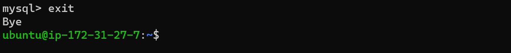

# PROJECT 2: LEMP STACK IMPLEMENTATION

# Documentation of Project-2

## Installing the nginx web server

`sudo apt update`

### Installing Nginx

`sudo apt install nginx`

### To verify that nginx was successfully installed and is running as a service in Ubuntu

`sudo systemctl status nginx`

### With EC2 configuration open to inbound connection through port 80, server is being accessed locally in Ubuntu shell:

`curl http://localhost:80`

### Accessing web server over the internet using public IP

[url with public IP](http://51.20.60.0)

## Installing mysql

### installing mysql using apt

`sudo apt install mysql-server`

### Logging into mysql console

`sudo mysql`

### setting a password for the root user, using mysql_native_password as default authentication method

`ALTER USER 'root'@'localhost' IDENTIFIED WITH mysql_native_password BY '******';`

### Exiting mysql console

`exit`

### Running interactive security script to lockdown access on database

`sudo mysql_secure_installation`

### A strong mysql_native_password was maintained!

### Testing logon access to mysql console

`sudo mysql -p`

### Exiting mysql console again:

`exit`

## Installing PHP

### To install php-fpm and php-mysql to tell Nginx to pass PHP requests to this software for processing and to communicate with MySQL-based databases, respectively

`sudo apt install php-fpm php-mysql`

## Configuring nginx to use php processor

### Creating the root web directory for projectLEMP domain

`sudo mkdir /var/www/projectLEMP`

## Assigning ownership of the directory with the $USER environment variable, which will reference current system user:

`sudo chown -R $USER:$USER /var/www/projectLEMP`

## opening new configuration file in Nginx’s sites-available directory using nano:

`sudo nano /etc/nginx/sites-available/projectLEMP`

The following bare-bones configuration was entered:

### Activating configuration by linking to the config file from Nginx’s sites-enabled directory:

`sudo ln -s /etc/nginx/sites-available/projectLEMP /etc/nginx/sites-enabled/`

### Testing configuration for syntax errors

`sudo nginx -t`

### Disabling default Nginx host that is currently configured to listen on port 80

`sudo unlink /etc/nginx/sites-enabled/default`

### Reloading Nginx to apply the changes:

`sudo systemctl reload nginx`

### Creating an index.html file in web root directory to test that new server block works as expected:

`sudo echo 'Hello LEMP from hostname' $(curl -s http://169.254.169.254/latest/meta-data/public-hostname) 'with public IP' $(curl -s http://169.254.169.254/latest/meta-data/public-ipv4) > /var/www/projectLEMP/index.html`

### opening website URL from browser using IP address:

[url from browser](http://http://16.16.201.156/)

# The index html file will be left in place as a temporary landing page for the application until an index.php file is created to replace it. Once that is done, the index.html file will be renamed or removed from the document root, as it would take precedence over an index.php file by default.

## Testing PHP with nginx

### Creating a new file called info.php within document root in nano text editor:

`sudo nano /var/www/projectLEMP/info.php`

### The following config code was entered

### accessing page from web browser by visiting the domain name or public IP address set up in Nginx configuration file, followed by /info.php:

`http://`server_domain_or_IP`/info.php`

### After checking the relevant information about the PHP server through that page, it’s best to remove the created info.php file as it contains sensitive information about the PHP environment and Ubuntu server.

`sudo rm /var/www/projectLEMP/info.php`

## Retreiving Data from mysql database with php

### connect to the MySQL console using the root account:

`sudo mysql`

### To create a new database

`mysql> CREATE DATABASE `example_database`;`

### Creating a user and granting user full privileges to the newly created database

`mysql>  CREATE USER 'example_user'@'%' IDENTIFIED WITH mysql_native_password BY '*******';`

### Giving user permission to database created

`mysql> GRANT ALL ON example_database.* TO 'example_user'@'%';`

### Exiting mysql shell

`mysql> exit`

### Testing new user has proper permissions by logging into mysql console using custom user credentials:

`mysql -u example_user -p`

### Confirming access to the example_database database:

`mysql> SHOW DATABASES;`

### creating  a test table named todo_list by running the following commands

`CREATE TABLE example_database.todo_list (`

`mysql>     item_id INT AUTO_INCREMENT,`

`mysql>     content VARCHAR(255),`

`mysql>     PRIMARY KEY(item_id)`

`mysql> );`

### Inserting rows of content into the test table

`mysql> INSERT INTO example_database.todo_list (content) VALUES ("My first important item");`

`mysql> INSERT INTO example_database.todo_list (content) VALUES ("My second important item");`

`mysql> INSERT INTO example_database.todo_list (content) VALUES ("My third important item");`

`mysql> INSERT INTO example_database.todo_list (content) VALUES ("and this one more thing");`

### To confirm the data was successfully saved to the table

`mysql>  SELECT * FROM example_database.todo_list;`

### Exiting sql

`mysql> exit`

### creating a PHP script that will connect to MySQL and query for content. Creating a new PHP file in custom web root directory using nano  editor:

`nano /var/www/projectLEMP/todo_list.php`

### The following content is entered and saved into the todo_list.php script. The PHP script connects to the MySQL database and queries for the content of the todo_list table, displays the results in a list. If there is a problem with the database connection, it will throw an exception.

`<?php`
`$user = "example_user";`
`$password = "password";`
`$database = "example_database";`
`$table = "todo_list";`

`try {`
  `$db = new PDO("mysql:host=localhost;dbname=$database", $user, $password);`
  `echo "<h2>TODO</h2><ol>";`
  `foreach($db->query("SELECT content FROM $table") as $row) {`
    `echo "<li>" . $row['content'] . "</li>";`
  `}`
  `echo "</ol>";`
`} catch (PDOException $e) {`
    `print "Error!: " . $e->getMessage() . " ";`
    `die();`
`}`

### accessing the page in web browser using domain name or public IP address configured for the website, followed by /todo_list.php:

[url](http://54.209.203.146/todo_list.php)

# PHP environment is ready to connect and interact with MySQL server.

# We have built a flexible foundation for serving PHP websites and applications to visitors, using Nginx as web server and MySQL as database management system.